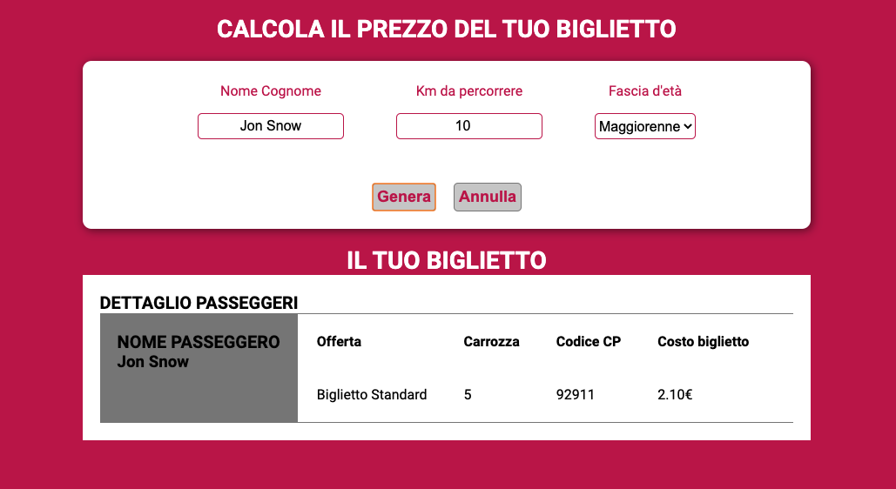

# Biglietto Treno Form

### Descrizione

L'obbiettivo di questa repo è quello di implementare un form in pagina in cui l'utente potrà inserire vari dati (tramite input) e visualizzare il calcolo finale del prezzo di un biglietto del treno.

Il calcolo del prezzo è basato sulla repo precedente (_[js-biglietto-treno](https://github.com/Luigi-Iorio/js-biglietto-treno.git)_).

## Risoluzione in linguaggio naturale

1.  Richiedere all'utente (tramite input) i km da percorrere e salvare il dato in una variabile
2.  Richiedere all'utente (tramite input) l'età del passegiero e salvare il dato in una variabile
3.  Calcolare il prezzo del biglietto (numero di km \* 0.21) e salvare il risultato in una variabile
4.  Applicare in base alle condizioni i vari sconti:

         if (etaUtente < 18){
             applicare sconto del 20%
         } else if (etaUtente > 65){
             applicare sconto del 40%
         }

5.  Visualizzare il risultato in console
6.  Visualizzare il recap dei dati e generare il biglietto del treno in pagina, (il layout prende spunto dallo screenshot fornito)

### Screenshot di riferimento

## Layout finale

